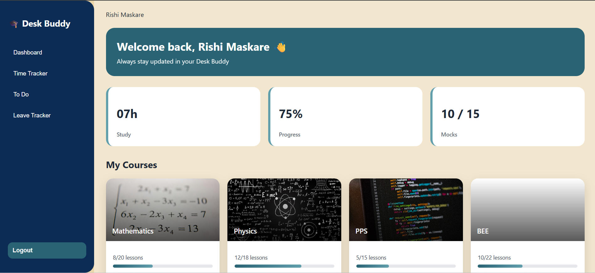
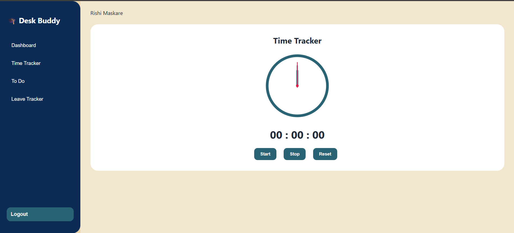
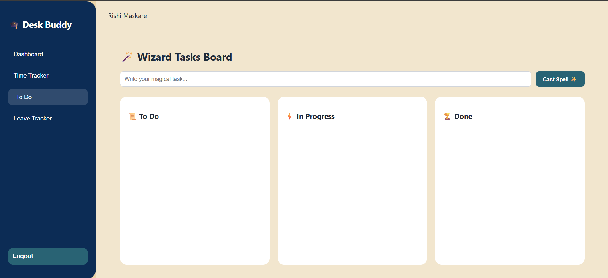
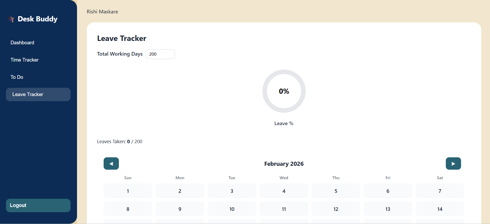

# 📚 Desk Buddy – Student Productivity Dashboard

**Desk Buddy** is a comprehensive productivity hub built with **React.js**, designed to help students streamline their academic life. From tracking course progress to managing study sessions with a themed To-Do board, this dashboard brings everything into one cohesive interface.

This project showcases component-based architecture, efficient state management, and data persistence using frontend best practices.

---

## 🚀 Preview





---

## ✨ Features

* 🔐 **Authentication**: Functional Sign Up & Login system.
* 📊 **Course Tracking**: Visualize academic progress with dynamic progress bars.
* ⏱️ **Study Time Tracker**: Integrated Start/Stop/Reset timer for deep work sessions.
* ⚡ **Harry Potter–Themed To-Do Board**: Manage tasks with a touch of magic.
* 📅 **Leave Tracker**: Log absences with a calendar view and visual donut charts.
* 💾 **Persistent Storage**: All data is saved to `localStorage`, so your progress stays even after a refresh.
* 📱 **Responsive Design**: Clean UI optimized for various screen sizes.

---

## 🧠 Tech Stack

| Layer | Technology |
| :--- | :--- |
| **Frontend** | React.js |
| **Styling** | CSS3 (Custom Properties) |
| **Storage** | LocalStorage API |
| **Icons** | FontAwesome / Lucide React (optional) |

---

## 📂 Folder Structure
```text
desk-buddy/
├── public/              # Static assets (favicon, index.html)
├── src/
│   ├── assets/          # Project screenshots & illustrations
│   │   ├── homepage.png
│   │   ├── leavetracker.png
│   │   ├── timetracker.png
│   │   └── todo.png
│   ├── components/      # Reusable UI components
│   ├── pages/           # Main page views/layouts
│   ├── App.js           # Main component logic
│   ├── App.css          # App-wide styles
│   ├── App.test.js      # Testing file
│   ├── index.js         # Entry point
│   └── index.css        # Global styles
├── .gitignore           # Files to ignore in Git
├── package.json         # Project dependencies & scripts
└── README.md            # Project documentation
```

## 🛠️ Getting Started (Local Setup)
Follow these steps to get a local copy up and running:

## 1️⃣ Clone the repository
```bash
git clone [https://github.com/your-username/desk-buddy.git](https://github.com/your-username/desk-buddy.git)
cd desk-buddy
```
## 2️⃣ Install Dependencies
```bash
npm install
```

## 3️⃣ Start the Development Server
```bash
npm start
```

Your app will run at: http://localhost:3000

## 👩‍🎓 Authors
Created with ❤️ by Sabeena 
a project built to bridge the gap between UI design and frontend logic, especially for engineering students.
